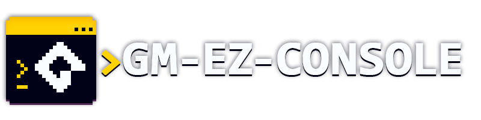
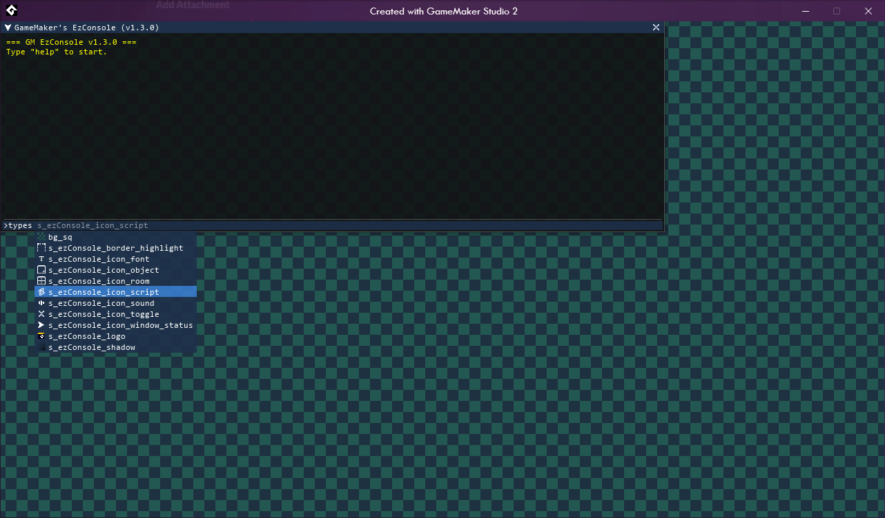
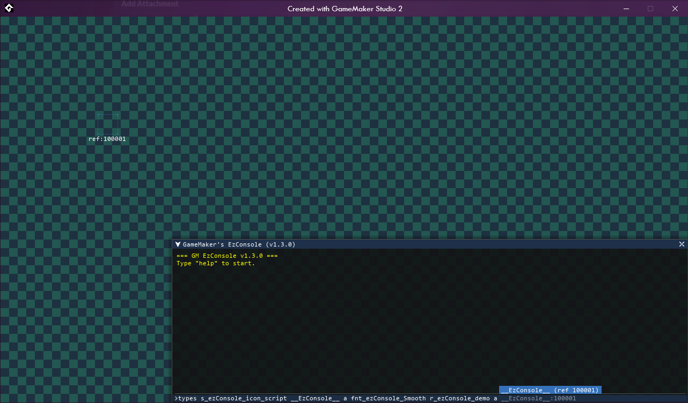

  

## An open-source GameMaker extension that natively integrates a customizable terminal console to your projects.

### 🗂️ **Compatible with GameMaker versions:**

### 📅 Last updated: 2024-03-20

---

  
  

---

### ✨ Author & Collaborators

Originally created by [**@DAndrewBox**](https://twitter.com/DAndrewBox_).

### 🙏 Special Thanks & Inspirations

- [**YoYo Games**](https://www.yoyogames.com/) for creating GameMaker.
- [**Ænigma**](https://www.dafont.com/aenigma.d188) For creating the `visitor` pixel font previously used on this project.

--- 

### 📋 Table of Contents

- [🌱 Getting Started](https://github.com/DAndrewBox/GM-EzConsole/wiki/Getting-Started)
- [📚 Documentation](https://github.com/DAndrewBox/GM-EzConsole/wiki/Documentation)
- [▶️ Commands](https://github.com/DAndrewBox/GM-EzConsole/wiki/Commands)
- [📜 License](#-license)
- [🤝 Contributing](#-contributing)

---

### 📜 License

This project is licensed under the MIT License. See the [LICENSE](LICENSE) file for more details.

---

### 🤝 Contributing

If you want to contribute to this project, you can do so by forking this repository, finding the addecuate branch and submitting a pull request.

You can also submit an issue if you find a bug or want to suggest a new feature, I'm open to add new features to this extension as long as I can see a use for it.

#### You can report your issues or suggest a new feature [here](https://github.com/DAndrewBox/GM-EzConsole/issues/new/choose)