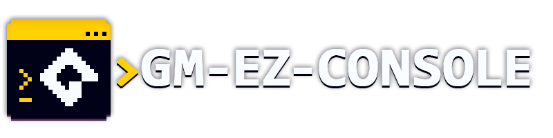
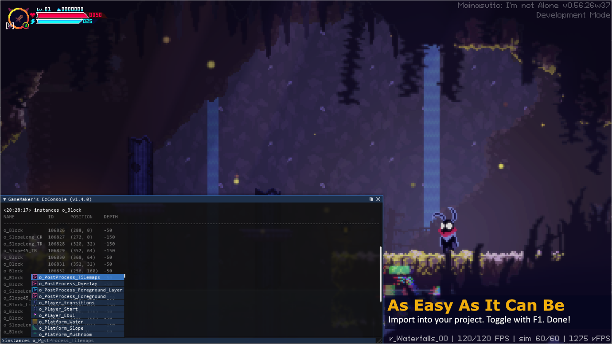
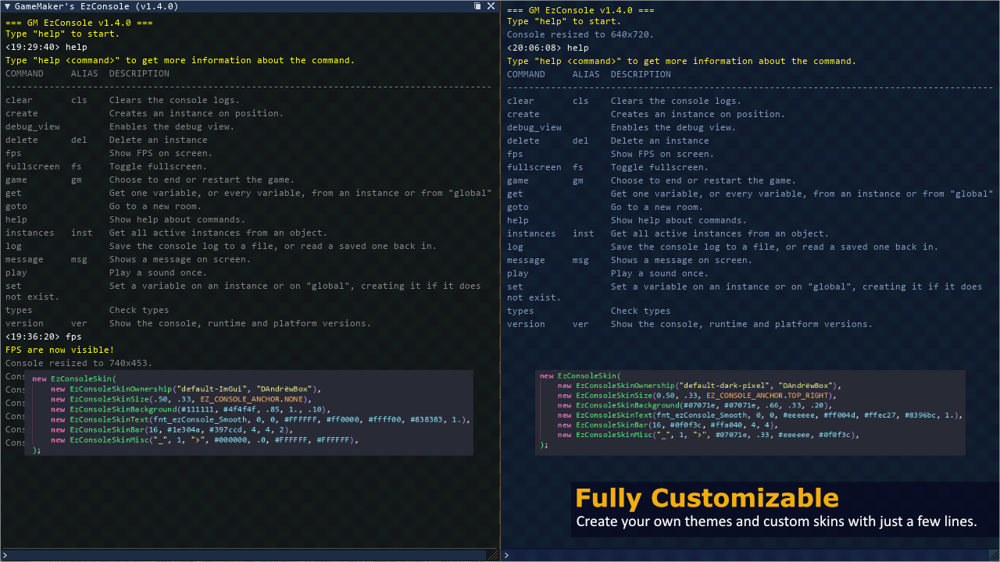
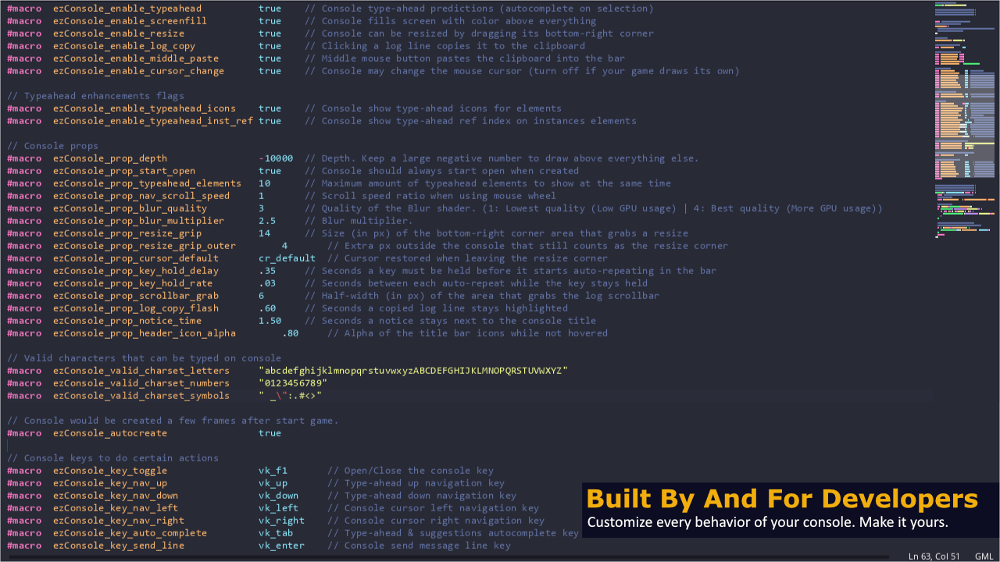
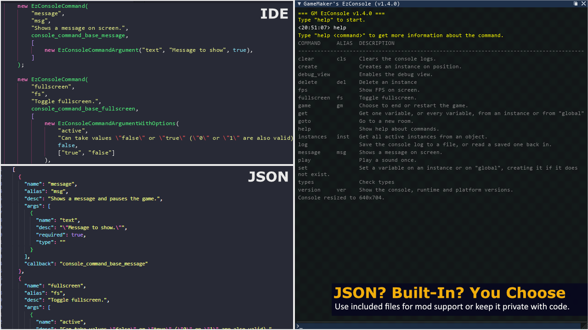
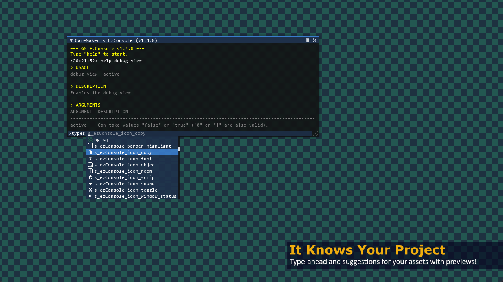

  

## An open-source GameMaker extension that natively integrates a customizable terminal console to your projects.

### 🗂️ **Compatible with GameMaker versions:**

### 📅 Last updated: 2026-09-08

---

  
  

  
  

---

### ⭐ Core Features

#### 🚀 Ready out of the box

- **Drop-in setup.** Import the package and press `F1`. No object to place, no code to write.
- **16 commands included.** Spawn and delete instances, read and write variables, change rooms, toggle fullscreen and the debug overlay, play sounds, check your build, save the log.
- **Debug builds only, if you want.** One flag keeps the console out of your release build entirely.
- **Logs to file.** Save the log on demand with `log save`, or automatically when the game ends, into the platform's own save folder.
- **Cross-platform.** Windows, macOS, Linux and consoles (No mobile or HTML5, sorry).

#### 🔍 Debug a running game

- **It knows your project.** Type-ahead completes your sprites, objects, sounds, fonts, rooms and scripts as you type, each with its own asset icon.
- **Find instances visually.** Pick one from the suggestions and it is highlighted in the room, ref id and all, so you always know which one you are about to touch.
- **Read and write anything.** `get` and `set` reach every variable on an instance, built-ins included, or on `global` - and `set` creates the variable if it does not exist yet.
- **Poke at the world.** Create instances at a position, list them with their id, position and depth, delete them, jump between rooms.

#### 🧩 Extend it with your own commands

- **Register a command in a few lines.** From code, or from a JSON file you can ship and edit separately.
- **Real arguments.** Name them, mark them required or optional, restrict them to a list of options, or type them as an asset so the console suggests your own assets for them.
- **Callbacks.** Hook into open, close, log, destroy and game end to wire the console into your own systems.
- **A small, clean API.** Log at four levels, ask whether the console is open, visible or focused, and show or hide it yourself.

#### 🎨 Looks and feels like part of your game

- **Fully themable.** Colors, fonts, size, anchor, padding and backdrop blur, from a `.skin` file or from code. Four skins included.
- **Behaves like a window.** Drag it, resize it from the corner, drag the scrollbar, click a log line to copy it, middle-click to paste, hold a key to repeat it.
- **Stays out of the way.** It only reads the keyboard while focused, so it never steals input from your game.
- **Around 40 configuration options.** Every behaviour above can be retuned or turned off from a single script.

---

### ✨ Author & Collaborators

Originally created by [**@DAndrewBox**](https://twitter.com/DAndrewBox_).

### 🙏 Special Thanks & Inspirations

- [**YoYo Games**](https://www.yoyogames.com/) for creating GameMaker.
- [**Ænigma**](https://www.dafont.com/aenigma.d188) For creating the `visitor` pixel font previously used on this project.

--- 

### 📋 Table of Contents

- [🌱 Getting Started](https://github.com/DAndrewBox/GM-EzConsole/wiki/Getting-Started)
- [📚 Documentation](https://github.com/DAndrewBox/GM-EzConsole/wiki/Documentation)
- [▶️ Commands](https://github.com/DAndrewBox/GM-EzConsole/wiki/Commands)
- [📜 License](#-license)
- [🤝 Contributing](#-contributing)

---

### 📜 License

This project is licensed under the MIT License. See the [LICENSE](LICENSE) file for more details.

---

### 🤝 Contributing

If you want to contribute to this project, you can do so by forking this repository, finding the addecuate branch and submitting a pull request.

You can also submit an issue if you find a bug or want to suggest a new feature, I'm open to add new features to this extension as long as I can see a use for it.

#### You can report your issues or suggest a new feature [here](https://github.com/DAndrewBox/GM-EzConsole/issues/new/choose)